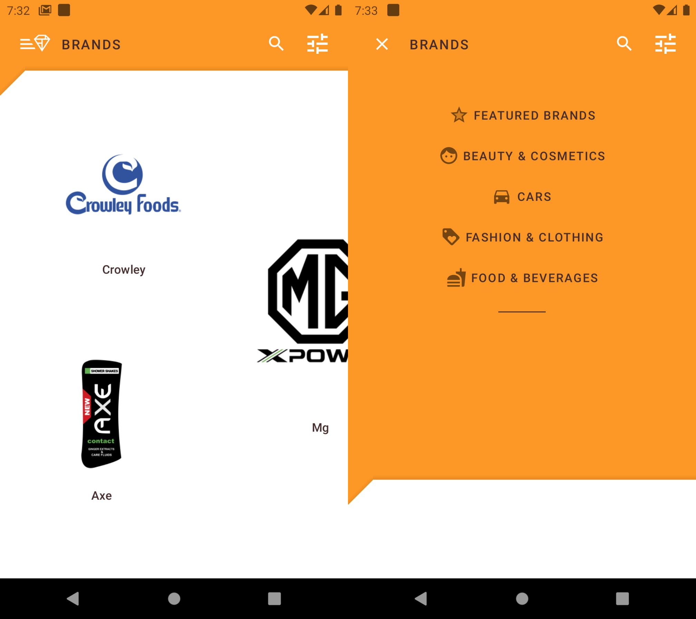
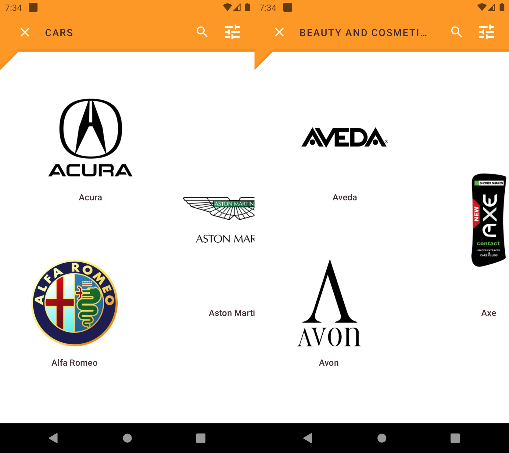

# Brands
### Shrine Android material design proposition based
#### This was based on MDC-104 for Material Components (kotlin)

I like Brands, whether beauty, cars, clothes or anything else. I like reading about there history and current situations.

For this, and part of my path learning native Android development, I came up with this idea: just a wiki for brands.

So I named it Brands.

## A glimpse of UI:

## Work in progress:
Refine the data mining algorithm here. Also human verification of each entry scrapped (title, Wikipedia summary and Logo).

Provide cache mechanism for "saving featured brands" probably using "Sharepreferences" or "SQLite" or anything else.

Probably port the wiki feed ("brands.json") to Firebase to let update of data separate from app release.

## Contribution

Please review scrapping and Google drive gists:

https://gist.github.com/bacloud14/7f88df9e1299fc40873f9f50c0f97e4a

https://gist.github.com/bacloud14/53662df855d7af363e01c224656791b2

Please see open issues for a specific issue, and do not hesitate to open any new issue (like better code, readability, modularity and best practice, performance, better UI or even functionality enhancements...).

#### Current priority: 

Please know that I am not a keen Android developer, but I may package this for Play store.

If you contribute, please consider that I can merge and publish a new release under that channel.

If you want to maintain the project with me, you can always ask.

Please keep it fair if you want to deploy anywhere, ask for permission.

Sweet coding !
